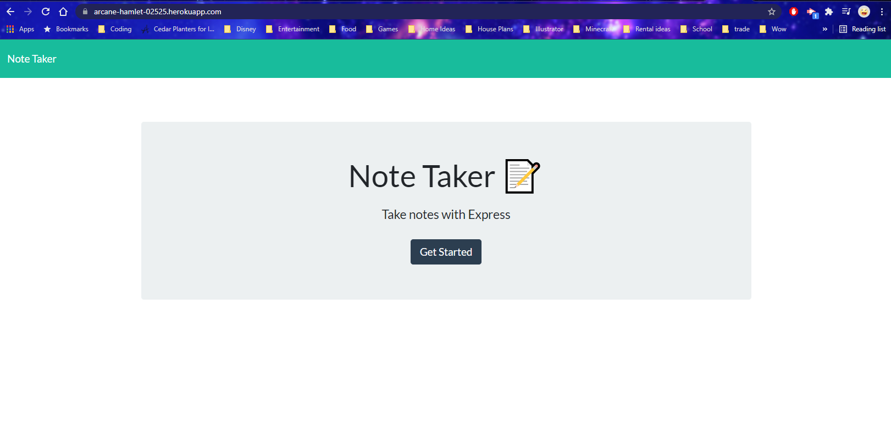
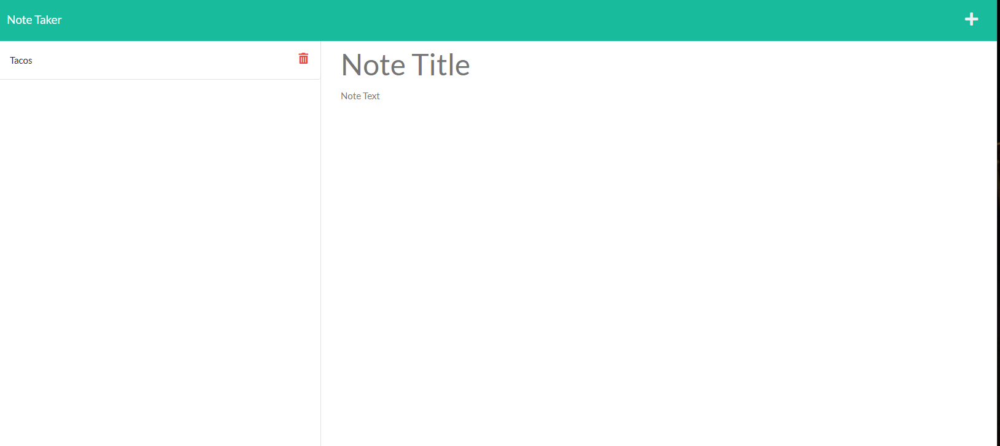
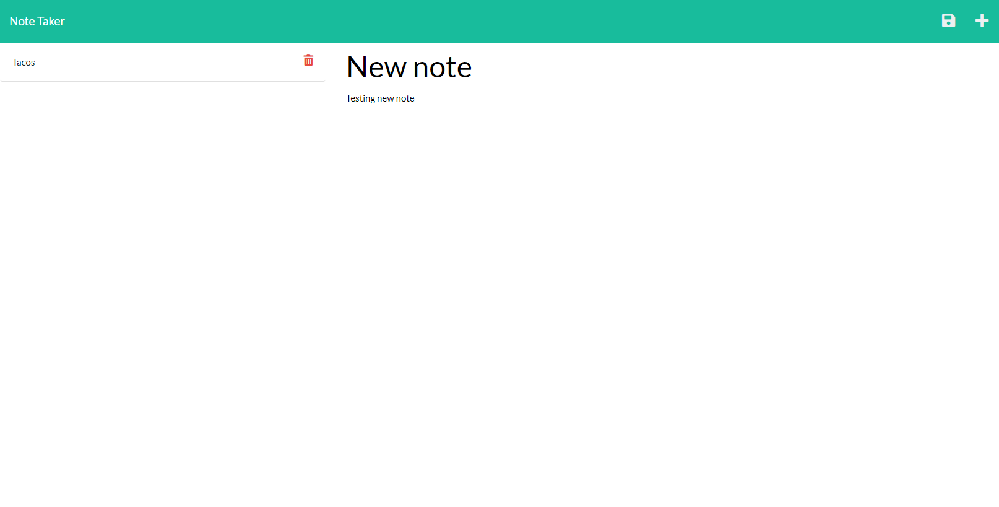
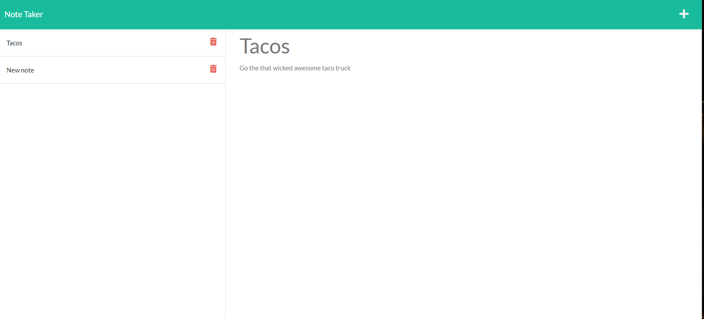
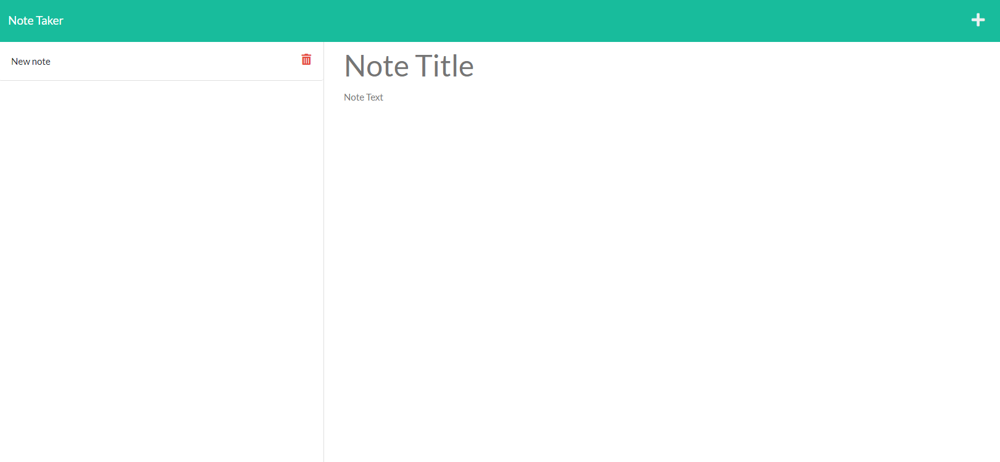

# 11 Express.js: Note Taker

## Your Task

Created an application called Note Taker that can be used to write and save notes. This application will use an Express.js back end and will save and retrieve note data from a JSON file.

## steps

* created the base file set up
* downloaded the starter code
* initialized npm and installed
* installed express and uniqid to make unique id's
* wrote the base server file
* created the html and api route files
* tested to make sure app functioned as intended
* set up heroku and pushed the app to heroku
* created the delete note function

## screenshots

## links
github repository: https://github.com/ToiletTakos/note-taker

heroku live kink: https://arcane-hamlet-02525.herokuapp.com/

